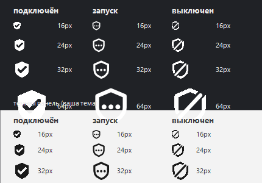

# HiddifyTray

Иконка состояния и переключатель [Hiddify](https://hiddify.com/) в области уведомлений Windows.
Клик по иконке или `Ctrl+Alt+V` — подключить или отключить VPN за 3–6 секунд, не открывая окно приложения.



## Зачем

Hiddify при запуске **не подключается сам** — он ждёт нажатия круглой кнопки в окне.
Если VPN нужен сразу после входа в систему, приходится каждый раз открывать окно и жать её вручную.

HiddifyTray делает это за вас и добавляет то, чего не хватает при повседневной работе:

- **статус видно постоянно** — иконка в трее, а не спрятанное окно;
- **переключение горячей клавишей** — без переключения на приложение;
- **автоподключение при входе в систему** — от загрузки до рабочего VPN около 15 секунд;
- **никаких запросов UAC** при каждом переключении.

## Как это работает

Ключевой момент: ядро включается и выключается **напрямую через gRPC-интерфейс `hiddify-core`** —
тем же вызовом, который делает кнопка в окне.

```
POST http://127.0.0.1:17078/hcore.Core/Start     # поднять ядро
POST http://127.0.0.1:17078/hcore.Core/Stop      # погасить ядро
POST http://127.0.0.1:17078/hcore.Core/GetSystemInfo
```

Сообщение пустое — параметров эти методы не требуют. Приложение при этом **не перезапускается**:
гаснет только туннель, окно и трей Hiddify остаются на месте.

Транспорт — [`src/hcore.ps1`](src/hcore.ps1): gRPC поверх HTTP/2 (h2c) средствами голого .NET,
без `grpcurl`, без `grpcio`, без единой внешней зависимости. gRPC-кадр собирается вручную:
один байт флага сжатия, четыре байта длины, дальше protobuf (здесь — пустой).

Подробный разбор, включая то, что **не** сработало: [docs/how-it-works.md](docs/how-it-works.md).

## Требования

| Компонент | Версия | Проверка |
|---|---|---|
| Windows | 10 или 11 | |
| [AutoHotkey](https://www.autohotkey.com/) | v2 | `winget install AutoHotkey.AutoHotkey` |
| PowerShell | 7+ | `winget install Microsoft.PowerShell` |
| Hiddify | 4.x | |

PowerShell 7 обязателен: HTTP/2 без TLS в Windows PowerShell 5.1 не поддерживается.

## Установка

```powershell
git clone https://github.com/imders/hiddify-tray.git
cd hiddify-tray
pwsh -ExecutionPolicy Bypass -File tools\install.ps1
```

Установщик скопирует файлы в `%LOCALAPPDATA%\HiddifyTray`, создаст две задачи планировщика
и ярлык в автозагрузке. Один раз попросит права администратора — они нужны для задач.

Удаление:

```powershell
pwsh -ExecutionPolicy Bypass -File tools\uninstall.ps1
```

Сам Hiddify не затрагивается.

## Использование

| Действие | Что делает |
|---|---|
| Клик по иконке | Переключить VPN |
| `Ctrl+Alt+V` | То же, глобально |
| Правый клик | Меню |

Состояния иконки различаются **формой**, а не только цветом — читаемо и в монохроме:

| Иконка | Состояние |
|---|---|
| Сплошной щит с галочкой | Подключён |
| Контур щита с точками | Идёт команда |
| Перечёркнутый контур | Отключён |

Цвет подстраивается под панель задач: белый на тёмной теме, графитовый на светлой —
тема считывается из реестра и подхватывается на лету.

Подсказка при наведении показывает активный маршрут и текущую скорость.

### Меню

- **Подключить / Отключить / Перезапустить ядро**
- **Открыть окно Hiddify** — если нужно само приложение
- **Завершить приложение** — полностью выгрузить Hiddify
- **Подключать при запуске** — поднимать VPN при входе в систему *(включено)*
- **Восстанавливать при обрыве** — переподключаться, если связь отвалилась *(выключено, см. ниже)*
- **Автозапуск при входе** — включает и выключает задачу планировщика
- **Открыть журнал** — все команды и смены состояния

Восстановление при обрыве выключено намеренно: отключение через окно Hiddify внешне
неотличимо от обрыва связи, и включённая опция переподключала бы VPN против воли пользователя.
Уведомление о разрыве приходит в любом случае.

## Зачем задачи планировщика

Hiddify в режиме TUN требует повышенных прав. Задача с `RunLevel Highest` решает сразу две проблемы:
приложение поднимается при входе в систему, и трей запускает его через `schtasks /Run`
**без UAC-окна** при каждом переключении.

| Задача | Назначение |
|---|---|
| `Hiddify_Autostart` | Запуск при входе (задержка 10 с) и по команде трея |
| `Hiddify_Stop` | Полное завершение приложения |

Обычное переключение VPN эти задачи не использует — оно идёт через gRPC.

## Тесты

```powershell
pwsh -ExecutionPolicy Bypass -File tests\Run-Tests.ps1
```

Безопасный набор: проверяет окружение, синтаксис обоих скриптов, наличие и многоразмерность иконок,
отсутствие личных данных в исходниках и работу gRPC-транспорта. Ничего не переключает.

```powershell
pwsh -ExecutionPolicy Bypass -File tests\Run-Tests.ps1 -Destructive
```

Дополнительно прогоняет полный цикл `stop` → `start`. **VPN на время теста разрывается** и затем
восстанавливается; тест проверяет в том числе, что приложение пережило остановку ядра.

## Устранение неполадок

**Иконка серая, VPN не поднимается.** Откройте журнал через меню трея — там видно каждую команду
и её результат. Файл лежит в `%LOCALAPPDATA%\HiddifyTray\hiddifytray.log`.

**Долгое подключение.** Проверьте настройку DNS в Hiddify. Если там указан DoH по доменному
имени (например `https://dns.google/dns-query`), его адрес нужно сначала где-то разрезолвить —
обычно через UDP-порт 53, который у части провайдеров блокируется или подменяется, и запрос
уходит в десятисекундные таймауты. Помогает DoH по IP-литералу: `https://1.1.1.1/dns-query` —
резолвить тогда просто нечего.

**Хоткей не срабатывает.** Занят другой программой — поменяйте `HotkeyToggle` в начале
`HiddifyTray.ahk` ([синтаксис AHK](https://www.autohotkey.com/docs/v2/Hotkeys.htm)).

**Две иконки в трее.** Родную иконку Hiddify можно убрать в переполнение: параметры Windows →
Персонализация → Панель задач → Другие значки в области уведомлений.

## Совместимость

Проверено на Windows 11 и Hiddify 4.1.1 (sing-box 1.13.1). Порт gRPC у Hiddify стабильно `17078`,
но зашитым намертво он не является: если порт не отвечает, `hcore.ps1` переберёт остальные
порты процесса и найдёт рабочий.

## Лицензия

[MIT](LICENSE)

Проект не связан с командой Hiddify и не является её продуктом.
